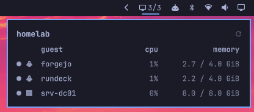

# Proxmox Plugin for Omarchy

A bar widget for [Omarchy Quattro](https://omarchy.org) showing Proxmox VE guest status, CPU and memory usage at a glance.

The bar shows `running / total`. Click it for a panel listing every guest with its live metrics. 
The widget turns to the bar's alert colour when the API is unreachable, or when a guest you explicitly watch is not running.



## Requirements

- `curl` and `jq` on the machine running Omarchy
- A Proxmox VE API token with the read-only `PVEAuditor` role

## Setup

### 1. Create a read-only API token

On your Proxmox node:

```sh
pveum user add omarchy@pve --comment "Omarchy bar widget (read-only)"
pveum user token add omarchy@pve bar --privsep 1
pveum acl modify / --users  'omarchy@pve'     --roles PVEAuditor
pveum acl modify / --tokens 'omarchy@pve!bar' --roles PVEAuditor
```

The token secret is displayed once, at creation. Copy it now.

Both ACL lines are required. With privilege separation enabled the token's effective permissions are the intersection of the user's and the token's, so granting the role to only one of them yields no access at all — and `/cluster/resources` returns an empty list rather than a 403.

### 2. Store the credentials outside `shell.json`

```sh
install -d -m 700 ~/.config/omarchy/proxmox
cat > ~/.config/omarchy/proxmox/credentials <<'EOF'
PVE_TOKEN_ID='omarchy@pve!bar'
PVE_TOKEN_SECRET='<the secret from step 1>'
EOF
chmod 600 ~/.config/omarchy/proxmox/credentials
```

Single quotes matter: the token id contains `!`, which bash would otherwise treat as history expansion.

**Never put the token in `shell.json`.** That file is plugin configuration, not a secret store, and it is the kind of file people keep in their dotfiles repo.
The widget only ever learns the *path* to the credentials file.

### 3. Trust the cluster CA

Proxmox generates its own PKI at install time. Copy the cluster CA to the system trust store so TLS verification succeeds without special-casing:

```sh
# Print it on the node, paste it locally
cat /etc/pve/pve-root-ca.pem

sudo cp pve-root-ca.pem /etc/ca-certificates/trust-source/anchors/pve.crt
sudo trust extract-compat
```

Verify — a `401` means the TLS handshake succeeded and only authentication is missing, which is what you want at this point:

```sh
curl -s -o /dev/null -w '%{http_code}\n' https://your-node.example.com:8006/api2/json/version
```

The endpoint host must match the certificate's CN or a SAN entry. 
Check what the node presents with:

```sh
openssl s_client -connect <node>:8006 </dev/null 2>/dev/null \
  | openssl x509 -noout -subject -ext subjectAltName
```

If you prefer not to touch the system trust store, point the `caBundle` setting at a local copy of the CA instead.

## Install

```sh
omarchy plugin add https://github.com/g-desoutter/omarchy-plugin-proxmox.git --enable
```

## Settings

Settings are inline on the widget's entry in `~/.config/omarchy/shell.json`:

```json
{
  "id": "io.github.gdesoutter.proxmox",
  "endpoint": "https://your-node.example.com:8006",
  "label": "homelab",
  "watchedGuests": [500]
}
```

| Key | Default | Description |
| --- | --- | --- |
| `endpoint` | `https://proxmox.example.com:8006` | PVE API base URL. Must match the certificate CN or a SAN. |
| `credentialsFile` | `~/.config/omarchy/proxmox/credentials` | Absolute path to the credentials file. |
| `caBundle` | *(system trust store)* | Absolute path to a CA bundle, if you did not install the CA system-wide. |
| `interval` | `15` | Refresh interval in seconds. Values below 10 gain nothing — see below. |
| `label` | *(the endpoint)* | Name shown in the panel header. |
| `watchedGuests` | `[]` | VMIDs whose shutdown is abnormal. Empty means never alert on a stopped guest. |

`allowMultiple` is enabled, so you can add one widget per cluster.

### On `watchedGuests`

A stopped guest is not inherently a problem — lab VMs and templates are meant to be off. The widget cannot know your intent, so you declare it: list only the VMIDs whose absence is genuinely abnormal. Everything else is ignored, and the
widget stays quiet.

## Notes

**Refresh interval.** `pvestatd` refreshes `/cluster/resources` roughly every 10 seconds, so polling faster than that re-reads the same sample. The widget floors the interval at 10s for this reason. Guest `status` changes, unlike metrics, are immediate — stopping a VM is reflected on the next poll, or instantly via the panel's refresh button.

**Memory figures.** `mem` is memory as seen by the hypervisor, not pressure inside the guest. A Linux guest filling its page cache, or a Windows guest caching aggressively, will read high without being short of RAM. Don't size guests from this number; check *Available Memory* inside the guest instead.

**CPU figures.** `cpu` is already normalised across all vCPUs assigned to the guest, so 100% means the guest is saturating its allocation — not one core.

**Guest OS icons.** The OS type comes from each VM's `ostype` config field, which is declarative rather than detected — a guest created with the wrong value shows the wrong icon. 
It is cached for 24 hours under `$XDG_CACHE_HOME/omarchy-proxmox`, so the extra request happens once per guest per day.Containers always show the container icon.

## Privileges

The plugin issues a single read-only `GET /api2/json/cluster/resources?type=vm` through `curl`. It never writes to the cluster, never runs an install hook, never asks for sudo, and never disables TLS verification. The poller is a
plain shell script in `bin/` — read it before enabling the plugin.

Like every Omarchy plugin, this runs unsandboxed inside the long-lived shell process, with your user's permissions.

## Remove

```sh
omarchy plugin remove io.github.gdesoutter.proxmox
```

## License

MIT — see [LICENSE](LICENSE).
